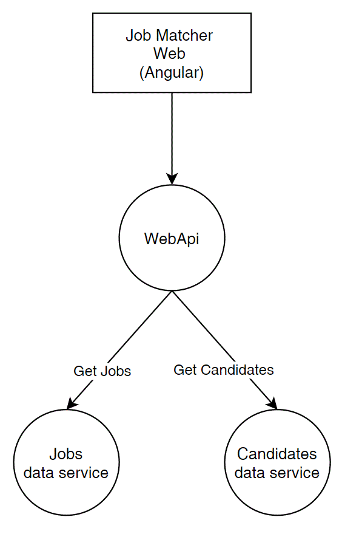
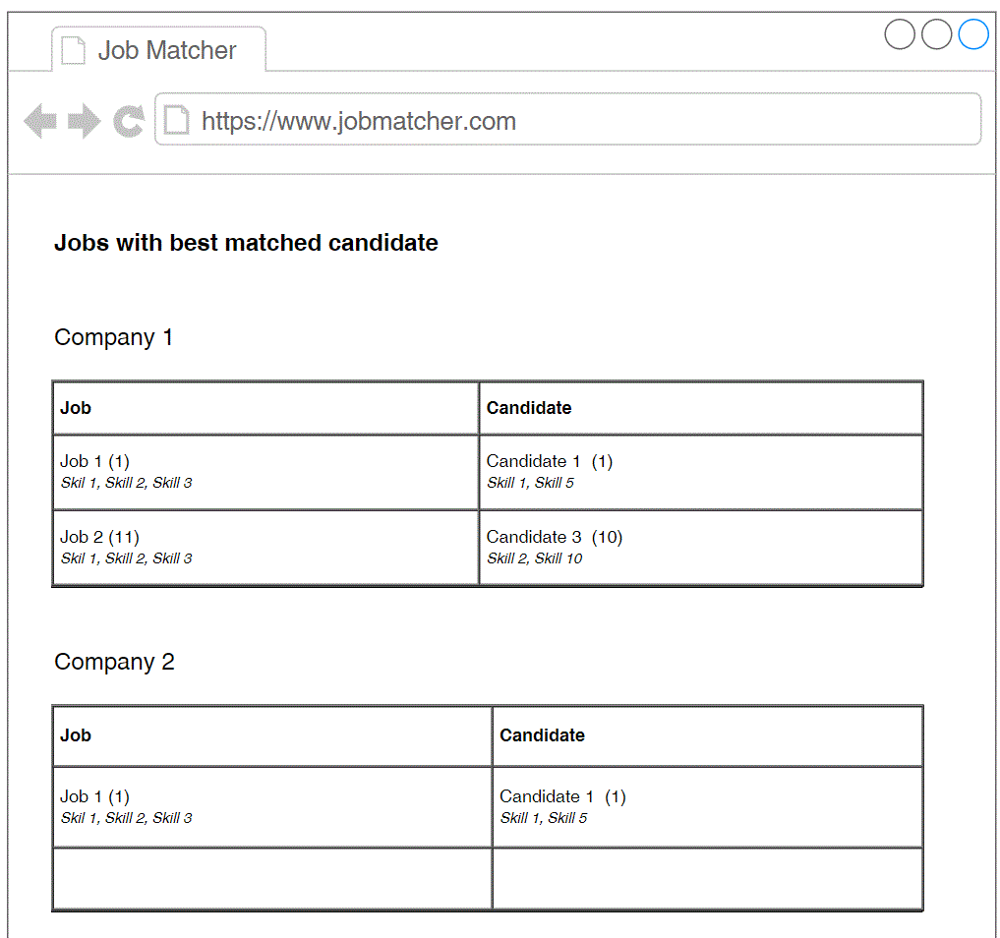
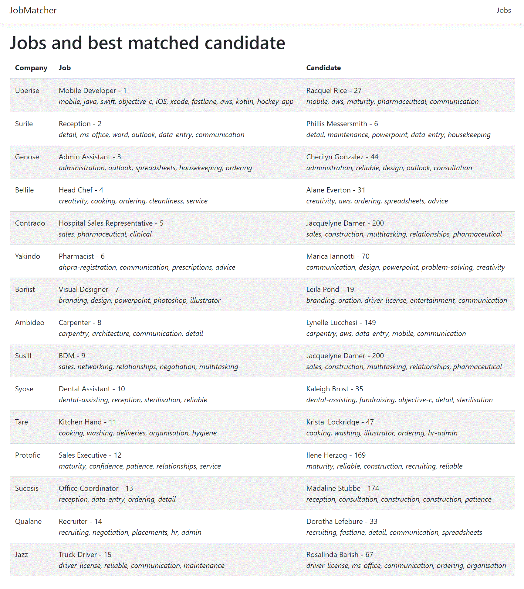

# Requirements

**JobAdder Coding Challenge**

# Solution design

# Page mock-up

# Job to Candidate matching logic
Job SkillTags: Skill 1, Skill 2, Skill 3

Candidate 1 Skills: Skill 2, Skill 1, Skill 5

Candidate 2 Skills: Skill 1, Skill 5, Skill 6

Candidate 2 Skills: Skill 5, Skill 6, Skill 1

Match priority: 
	
	1) Find candidates: Candidate first skill = Job first skill
	
		1.1 Found. 
		
				Find candidates: Candidate first skill = Job second skill
				
			1.1.1 Found
			
					Find candidates: Candidate first skill = Job third skill
					
					...continue
					
					"Return one candidate."
					
		1.2 Not Found:
		
				Find candidates: Candidate second skill = Job second skill
				
				1.2.1 Found: Similar to 1.1.1
				
		... continue
		
		Return "Candidate not found"
		
			
	2) Not found: 
		Find candidates: Candidate second skill = Job first skill

	3) Not found: 
		Continue with Candidate third, fourth,... skill
		
	4) Not found 
			Return "Candidate not found"
			

# Setup instruction
1) Create Directory C:\1, 
2) Navigate to this directory in PowerShell.
3) Run command: git clone https://github.com/ilyakb1/JobMatcher.git
4) Cd .\JobMatcher\src
5) Run "dotnet run"
6) Open http://localhost:5000

# Testing instructions
1) Run WebApi tests 

Go to .\JobMatcher\JobMatcher.Tests folder and run "dotnet test"

2) Run Jasmin tests

Go to .\JobMatcher\src\ClientApp folder and run "npm run test"

# Job Matching Result

# To Do
1) Add Backend tests to controller
2) Group jobs by company
3) Add front end unit test
4) Add Caching to job matching
5) Do algorithm more efficient for large number jobs, candidates and skills

